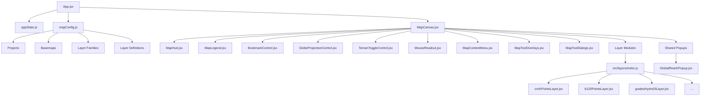
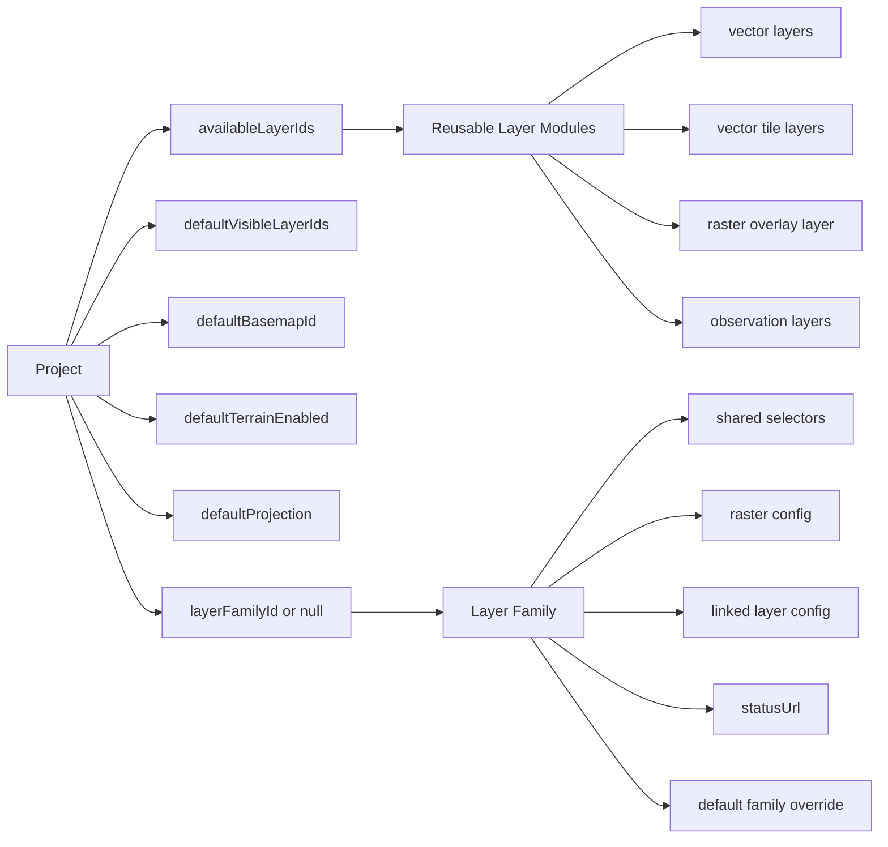
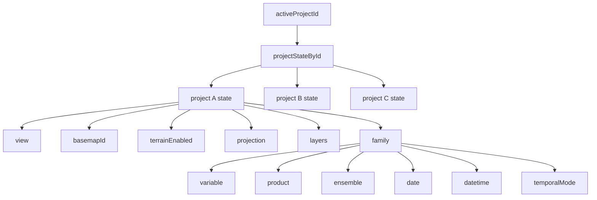
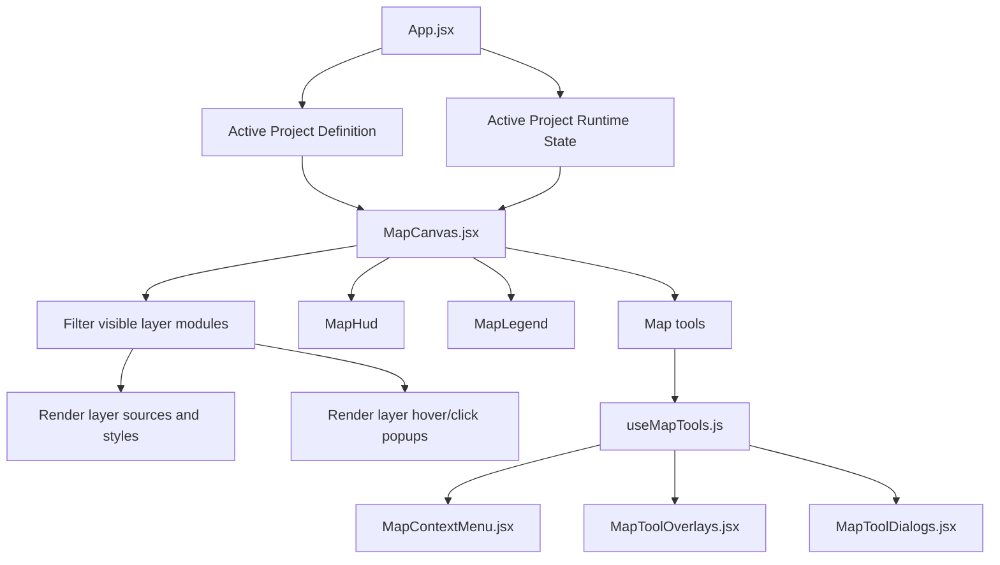
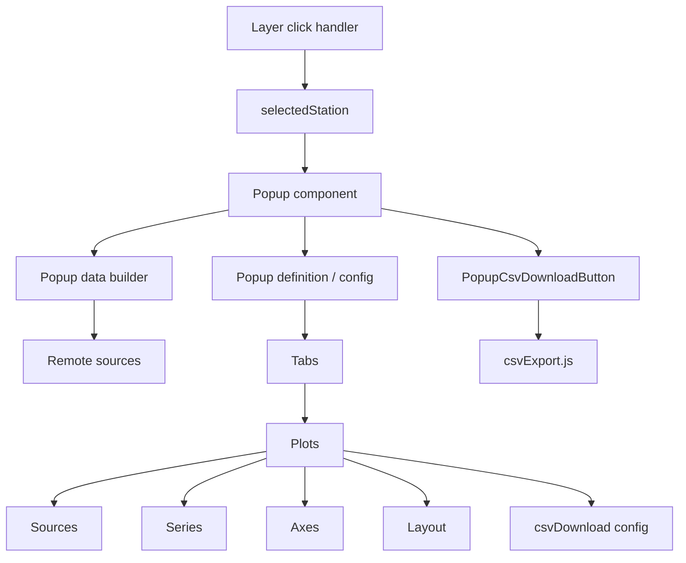
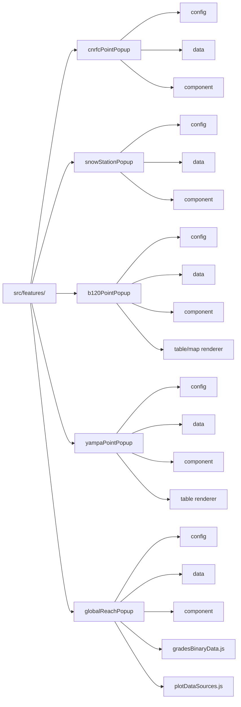
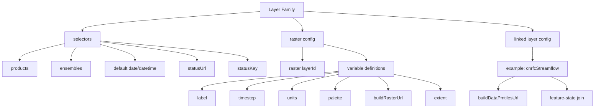
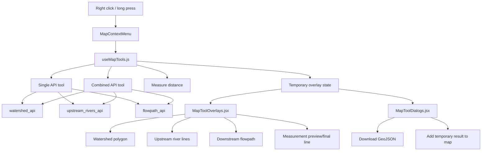
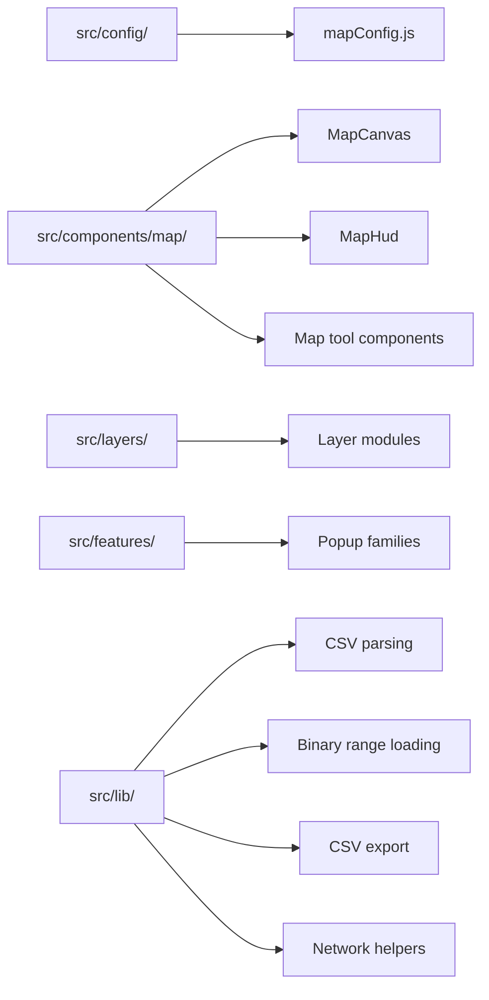

# Structure Diagrams

This page gives a visual overview of how the app is organized today.

The diagrams are written in Mermaid so they render on GitHub and stay easy to update as the codebase evolves.

## 1. Top-level app structure

## 2. Project-centered organization

## 3. Runtime state model

## 4. Rendering and interaction flow

## 5. Popup feature hierarchy

## 6. Popup families

## 7. Layer family hierarchy

## 8. Map tool system

## 9. Where things live

## Reading tips

- Start with diagram 1 if you want the bird's-eye view.
- Use diagrams 2 and 3 to understand how projects and state fit together.
- Use diagrams 5 and 6 when adding or modifying popup families.
- Use diagram 7 when adding a layer family, linked family layer, or raster variable.
- Use diagram 8 when adding more context-menu map tools.
